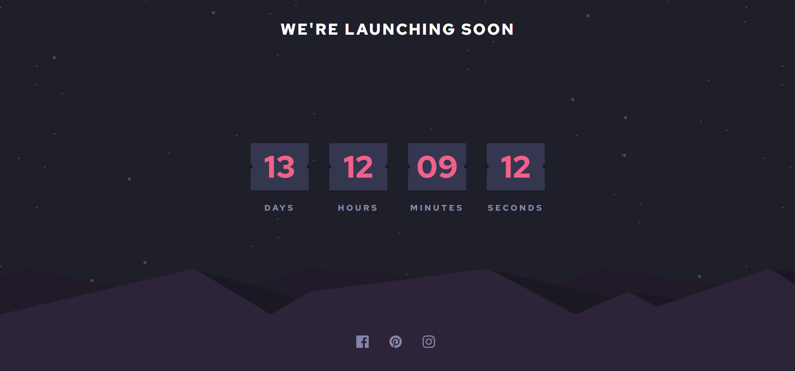

# Frontend Mentor - Launch countdown timer solution

This is a solution to the [Launch countdown timer challenge on Frontend Mentor](https://www.frontendmentor.io/challenges/launch-countdown-timer-N0XkGfyz-). Frontend Mentor challenges help you improve your coding skills by building realistic projects. 

## Table of contents

1. [Frontend Mentor - Launch countdown timer solution](#frontend-mentor---launch-countdown-timer-solution)
	1. [Table of contents](#table-of-contents)
		1. [The challenge](#the-challenge)
		2. [Screenshot](#screenshot)
		3. [Links](#links)
	2. [My process](#my-process)
		1. [Built with](#built-with)
		2. [What I learned](#what-i-learned)
		3. [Continued development](#continued-development)
	3. [Author](#author)

### The challenge

Users should be able to:

- See hover states for all interactive elements on the page
- See a live countdown timer that ticks down every second (start the count at 14 days)
- **Bonus**: When a number changes, make the card flip from the middle

### Screenshot

### Links

- Solution URL: [My Solution](https://www.frontendmentor.io/challenges/launch-countdown-timer-N0XkGfyz-/hub/launch-countdown-timer-vanilla-js-ng_TBx7Ap)
- Live Site URL: [Live Site](https://launch-countdown-timer-main-two.vercel.app/)

## My process

### Built with

- Semantic HTML5 markup
- CSS custom properties
- Flexbox
- [Tailwindcss](https://tailwindcss.com/) - CSS Utilities library
- [Vitejs](https://vitejs.dev/) - Front-end build tool

### What I learned

Learn how to formatting a date in javascript and get only specific time needed and some creative css do

### Continued development

this project might still be in development since i still having a hard time animating the flipped card

## Author

- Frontend Mentor - [@zynth17](https://www.frontendmentor.io/profile/zynth17)
- Twitter - [@hi_reeve](https://twitter.com/hi_reeve)
- Instagram - [@hi_reeve](https://www.instagram.com/hi_reeve/)
- Github - [zynth17](https://github.com/zynth17)